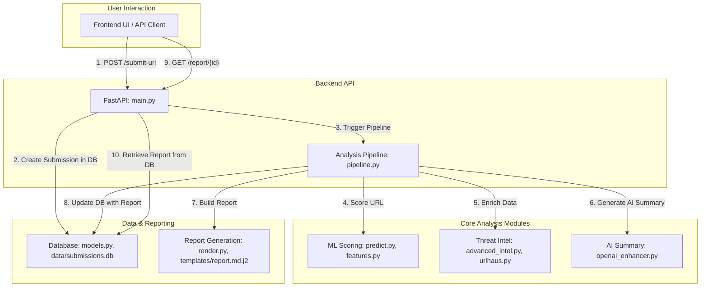

# Phishing Triage System: A-to-Z Workflow Analysis

This document provides a detailed, step-by-step analysis of the entire workflow for the Phishing Triage System, from the moment a URL is submitted to the final report generation. It highlights the key processes and the specific files responsible for each stage.

---

## High-Level Workflow Diagram

---

## Detailed Step-by-Step Breakdown

Here is the complete journey of a URL submission through the system.

### Step 1: Submission (The Input)

The process begins when a user submits a URL for analysis. This can happen in two ways:

1.  **Via the Web Interface**: The user navigates to `http://localhost:3000/`, enters a URL into the form, and clicks "Analyze". The JavaScript in the UI sends a `POST` request to the backend API.
    *   **File Used**: `frontend/index.html` - Contains the HTML form and JavaScript logic to handle the API request.

2.  **Via Direct API Call**: A user or an automated system (like a SOAR platform) sends a direct `POST` request with a JSON payload to the `/submit-url` endpoint.
    *   **File Used**: `backend/api/main.py` - The `/submit-url` endpoint (`submit_url_endpoint` function) is defined here. It receives the request and validates the incoming data using Pydantic schemas.

### Step 2: Queuing & Initial Database Record

Once the API receives a valid request, it immediately creates a record of the submission in the database. This ensures that every request is tracked, even if the analysis fails later.

*   **Files Used**:
    *   `backend/api/main.py`: The endpoint logic creates a new `Submission` object.
    *   `backend/api/models.py`: Defines the `Submission` SQLAlchemy model, which maps the object to the `submissions` table in the database.
    *   `data/submissions.db`: The SQLite database file where the new record is physically stored.

### Step 3: Handoff to the Analysis Pipeline

With the submission safely logged, the main API controller hands off the processing task to the core analysis pipeline.

*   **Files Used**:
    *   `backend/api/main.py`: Calls the `handle_url_submission` function.
    *   `backend/api/pipeline.py`: Contains the `handle_url_submission` function, which orchestrates all the subsequent analysis steps.

### Step 4: Machine Learning Scoring

The first analysis step is to score the URL's risk using the trained machine learning model.

1.  **Feature Extraction**: The pipeline first extracts meaningful features from the URL (e.g., length, special characters, entropy).
2.  **Prediction**: These features are then fed into the loaded classification model, which outputs a phishing probability score (from 0.0 to 1.0).

*   **Files Used**:
    *   `backend/api/pipeline.py`: Calls the `score_url` function.
    *   `backend/ml/predict.py`: Contains the `score_url` function, which loads the model and performs the prediction.
    *   `backend/ml/features.py`: Contains the `url_features` function, which performs the feature extraction.
    *   `backend/ml/model.joblib`: The pre-trained Scikit-learn model file that is loaded into memory for scoring.

### Step 5: Threat Intelligence Enrichment

Next, the pipeline queries external threat intelligence sources to see if the URL is already known to be malicious.

*   **Files Used**:
    *   `backend/api/pipeline.py`: Instantiates and uses the `ThreatIntelAggregator`.
    *   `backend/enrich/advanced_intel.py`: The `ThreatIntelAggregator` class coordinates calls to multiple sources.
    *   `backend/enrich/urlhaus.py`: Contains the logic to query the URLhaus API.
    *   `backend/enrich/free_intel.py`: Contains logic to query other free sources like VirusTotal.
    *   `.env`: This file provides the necessary API keys (e.g., `URLHAUS_AUTH_KEY`, `VT_API_KEY`) for these services.

### Step 6: Indicator of Compromise (IOC) Extraction

The system scans all the data gathered so far (the original URL, threat intel results) to extract actionable Indicators of Compromise (IOCs), such as IP addresses, domains, and file hashes.

*   **Files Used**:
    *   `backend/api/pipeline.py`: Calls the `extract_iocs` function. This function uses the `iocextract` third-party library to find IOCs in the collected text data.

### Step 7: AI-Powered Executive Summary

Using the analysis data, the system securely calls the OpenAI API to generate a natural-language, expert-level executive summary of the findings.

*   **Files Used**:
    *   `backend/api/pipeline.py`: Calls the `enhance_report_with_openai` function.
    *   `backend/reports/openai_enhancer.py`: Contains the logic to format the data, construct the prompt, and make the API call to OpenAI's `gpt-4o-mini` model.
    *   `.env`: Provides the `OPENAI_API_KEY` needed to authenticate with the OpenAI API.

### Step 8: Final Report Generation

All the collected data—ML score, threat intel, IOCs, and the AI summary—is compiled into a final, human-readable markdown report.

*   **Files Used**:
    *   `backend/api/pipeline.py`: Calls the `build_report` function.
    *   `backend/reports/render.py`: The `build_report` function gathers all the data into a "context" dictionary.
    *   `backend/reports/templates/report.md.j2`: A Jinja2 template file that defines the structure and layout of the final markdown report. `render.py` populates this template with the context data to produce the final string.

### Step 9: Storing the Final Report

The generated report and all analysis results are saved back to the database, updating the initial submission record.

*   **Files Used**:
    *   `backend/api/main.py`: After the pipeline returns the results, the main endpoint logic updates the `Submission` object with the report, score, IOCs, etc., and commits the changes.
    *   `data/submissions.db`: The SQLite database file is updated with the completed analysis.

### Step 10: Viewing the Report (The Output)

The user can now retrieve the completed report.

1.  **From the UI**: The frontend, after a short delay, makes a `GET` request to the `/report/{submission_id}` endpoint.
2.  **From the API**: The user can make a direct `GET` request to the same endpoint.

*   **Files Used**:
    *   `frontend/index.html`: The JavaScript logic polls or requests the report endpoint and then renders the returned markdown in the browser.
    *   `backend/api/main.py`: The `/report/{submission_id}` endpoint (`report` function) retrieves the completed record from the database and returns it to the client.
